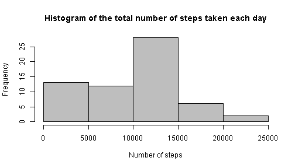

Reproducible Research Assignment 1
==================================
It is now possible to collect a large amount of data about personal movement using activity monitoring devices such as a Fitbit, Nike Fuelband, or Jawbone Up. These type of devices are part of the “quantified self” movement – a group of enthusiasts who take measurements about themselves regularly to improve their health, to find patterns in their behavior, or because they are tech geeks. But these data remain under-utilized both because the raw data are hard to obtain and there is a lack of statistical methods and software for processing and interpreting the data.

This assignment makes use of data from a personal activity monitoring device. This device collects data at 5 minute intervals through out the day. The data consists of two months of data from an anonymous individual collected during the months of October and November, 2012 and include the number of steps taken in 5 minute intervals each day.

## Loading and preprocessing data
### Load the data

```r
data <- read.csv("activity.csv")
```
### Process/transform the data into a format suitable for your analysis

```r
data$date <- as.Date(data$date)
```

## What is mean total number of steps taken per day?
### Make is histogram of the total number of steps taken each day

```r
h <- tapply(data$steps,data$date,sum,na.rm=TRUE)
hist(h,main="Histogram of the total number of steps taken each day",xlab="Number of steps",col="grey")
```

 
### Calculate and report the mean and median total number of steps taken per day

```r
mean(h)
```

```
## [1] 9354
```

```r
median(h)
```

```
## [1] 10395
```

## What is the average daily activity pattern?
### Make a time series plot of the 5-minute interval (x-axis) and the average number of steps taken, averaged across all days (y-axis)

```r
t <- tapply(data$steps,data$interval,mean,na.rm=TRUE)
plot(t,type="l",xlab="Time (with 5-minute intervals)",ylab="Average number of steps taken",xaxt="n")
r <- seq(1,length(t),length=10)
l <- sapply(sprintf("%04d",as.integer(names(t))),function(x){paste(substr(x,1,2),substr(x,3,4),sep=":")},USE.NAMES=FALSE)
axis(1,at=r,labels=l[r],cex.axis=0.75)
```

 
### Which 5-minute interval, on average across all the days in the dataset, contains the maximum number of steps?

```r
l[which.max(t)]
```

```
## [1] "08:35"
```

## Imputing missing values
### Calculate and report the total number of missing values in the dataset

```r
sum(is.na(data[1]))
```

```
## [1] 2304
```
### Devise a strategy for filling in all of the missing values in the dataset
I replace missing value by an average value of all days for that interval

```r
nsteps <- data$steps
for(i in seq_along(nsteps))
  if(is.na(nsteps[i]))
    nsteps[i] <- as.integer(round(t[as.character(data$interval[i])],0))
```
### Create a new dataset that is equal to the original dataset but with the missing data filled in

```r
data2 <- transform(data,steps=nsteps)
```
### Make a histogram of the total number of steps taken each day and calculate and report the mean and median total number of steps taken per day

```r
h2 <- tapply(data2$steps,data2$date,sum)
hist(h2,main="Histogram of the total number of steps taken each day",xlab="Number of steps",col="grey")
```

 

```r
mean(h2)
```

```
## [1] 10766
```

```r
median(h2)
```

```
## [1] 10762
```
Values of mean and median are different after replacing missing values. Imputing increases mean and median.

## Are there differences in activity patterns between weekdays and weekends?
### Create a new factor variable in the dataset with two levels -- "weekday" and "weekend"

```r
Sys.setlocale("LC_TIME","English")
```

```
## [1] "English_United States.1252"
```

```r
data2$wd <- ifelse(weekdays(data2$date) %in% c("Saturday","Sunday"),"weekend","weekday")
data2$wd <- as.factor(data2$wd)
```
#### How many there weekdays and weekends?

```r
table(sapply(split(data2,data2$date),function(x) x$wd[1]))
```

```
## 
## weekday weekend 
##      45      16
```
### Make a panel plot containing a time series plot of the 5-minute interval (x-axis) and the average number of steps taken, averaged across all weekday or weekend days (y-axis)

```r
par(mfrow=c(2,1))
t2 <- tapply(data2$steps,list(data2$interval,data2$wd),mean)
for(i in 1:2) {
  plot(t2[,i],type="l",main=ifelse(i==1,"Weekday","Weekend"),xlab="Time (with 5-minute intervals)",ylab="Average number of steps taken",xaxt="n",col="blue")
  axis(1,at=r,labels=l[r],cex.axis=0.75)
}
```

 
